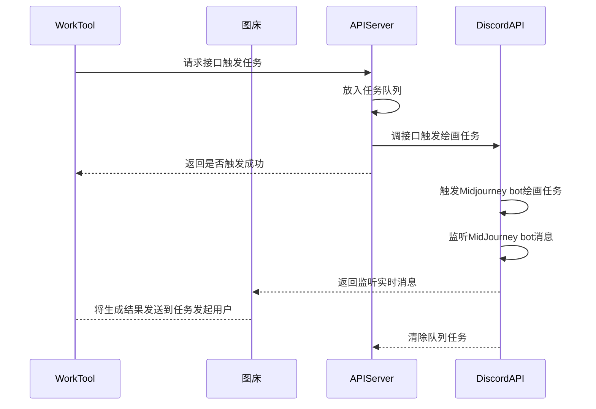

# 可用于微信机器人的midjourney框架

基于项目 https://github.com/yokonsan/midjourney-api 修改，支持大佬的坚实基础！

## UML



## 使用条件

1. 确保程序启动环境能访问 Discord
2. 已有 Midjourney、Discord 账户
3. 创建 Discord 频道并添加机器人
4. 注册worktool, 并准备一台破烂安卓手机
5. 购买两台云服务器，分别部署本项目和兰空图床（Lsky Pro）(https://github.com/lsky-org/lsky-pro)
6. 完整参考教程正在制作中，请关注氙舟实验室微信公众号


## 安装启动

```bash
git clone https://github.com/Happenmass/Midjourney_wechat_bot.git
cd Midjourney_wechat_bot
conda create -n mj python=3.8
conda activate mj
pip install -r requirements.txt
```

将文件`.env.template`重命名为`.env`，并填入参数值：

```
USER_TOKEN=用户token
BOT_TOKEN=机器人token
GUILD_ID=服务器ID
CHANNEL_ID=频道ID
DEEPL_API_KEY=deepl翻译的api key
IMG_BED_URL=部署的图床的api地址
CALLBACK_URL=回调地址，默认http post请求，用于接收 midjourney 作图进度和结果的服务
```

### 直接启动

```bash
# 启动监听机器人
python task_bot.py
# 启动http服务
python server.py
```

#### 更新

```bash
git pull

# 启动监听机器人
python task_bot.py /前台启动
bash start_bot.sh /后台启动
# 启动http服务
python server.py /前台启动
bash start_server.sh /后台启动
```
### 停止所有python服务（慎用）
```bash
bash stop.sh
```

接口`swagger`文档：[http://127.0.0.1:8062/docs](http://127.0.0.1:8062/docs)

`midjourney-api` 提供接口：

- [x]  `/v1/api/trigger/imagine`：触发绘画任务（图生图，Prompt 前加上图片链接即可）
- [x]  `/v1/api/trigger/imagine`：U
- [x]  `/v1/api/trigger/imagine`：V
- [ ]  `/v1/api/trigger/reset`：重绘       //暂未实现
- [ ]  `/v1/api/trigger/upload`：上传图片   //暂未实现
- [ ]  `/v1/api/trigger/describe`：通过上传图片名，生成 Prompt    //暂未实现
- [ ] `/v1/api/trigger/message`：发送图片消息，返回图片链接，用于图生图功能     //暂未实现


## 使用

### imagine

文生图

```bash
curl -X 'POST' \
  'http://127.0.0.1:8062/v1/api/trigger/imagine' \
  -H 'accept: application/json' \
  -H 'Content-Type: application/json' \
  -d '{ 
     "spoken": "你好",  //微信消息问题文本
     "rawSpoken": "@管家 你好", //原始问题文本
     "receivedName": "仑哥", //提问者名称
     "groupName": "测试群1", //QA所在群名（群聊）
     "groupRemark": "测试群1备注名",  //QA所在群备注名（群聊）
     "roomType": "1", //QA所在房间类型 1=外部群 2=外部联系人 3=内部群 4=内部联系人
     "atMe": true //是否@机器人（群聊）
}'
```

### upscale

```bash
curl -X 'POST' \
  'http://127.0.0.1:8062/v1/api/trigger/imagine' \
  -H 'accept: application/json' \
  -H 'Content-Type: application/json' \
  -d '{ 
     "spoken": "U+数字",  //微信消息问题文本
     "rawSpoken": "@管家 你好", //原始问题文本
     "receivedName": "仑哥", //提问者名称
     "groupName": "测试群1", //QA所在群名（群聊）
     "groupRemark": "测试群1备注名",  //QA所在群备注名（群聊）
     "roomType": "1", //QA所在房间类型 1=外部群 2=外部联系人 3=内部群 4=内部联系人
     "atMe": true //是否@机器人（群聊）
}'
```
### variation

```bash
curl -X 'POST' \
  'http://127.0.0.1:8062/v1/api/trigger/imagine' \
  -H 'accept: application/json' \
  -H 'Content-Type: application/json' \
  -d '{ 
     "spoken": "V+数字",  //微信消息问题文本
     "rawSpoken": "@管家 你好", //原始问题文本
     "receivedName": "仑哥", //提问者名称
     "groupName": "测试群1", //QA所在群名（群聊）
     "groupRemark": "测试群1备注名",  //QA所在群备注名（群聊）
     "roomType": "1", //QA所在房间类型 1=外部群 2=外部联系人 3=内部群 4=内部联系人
     "atMe": true //是否@机器人（群聊）
}'
```

### 管理用户  cetification.json
```json
{"0xeo": {"limits": 10, "last_message_id": "", "last_meassage_hash": ""}}
0xeo —— 用户备注名
limits —— 用户剩余次数
last_message_id —— 上次生成图像的id
last_message_hash —— 上次生辰图像的hash
```
### 管理vip用户 vip.json
```json
["0xeo", "1xeo", "..."]
将vip用户的备注名添加在这里，可以允许用户通过私聊生成图片
```
### 其他json status.json
```json
{"0xeo": {"last_type": ""}, "1xeo": {"last_type": "G"}}
last_type 记录了用户上一次的生成结果，避免使用U指令后message_id被覆盖，无法继续使用V指令的问题
```
- [x] imagine
- [x] upscale
- [x] variation
- [x] 敏感词过滤上报
- [x] 任务队列（内存存储，不希望引入外建，可加入异常落盘）
- [x] 超时任务返回异常结果
- [x] 管理用户提交的数量
- [x] 管理是否允许用户私聊

## 我们搭建了一个免费的机器人供大家试用，扫码后机器人会自动通过请求，每个用户默认vip用户，可以直接私聊体验，也可以加群交流技术问题


## enjoy it
